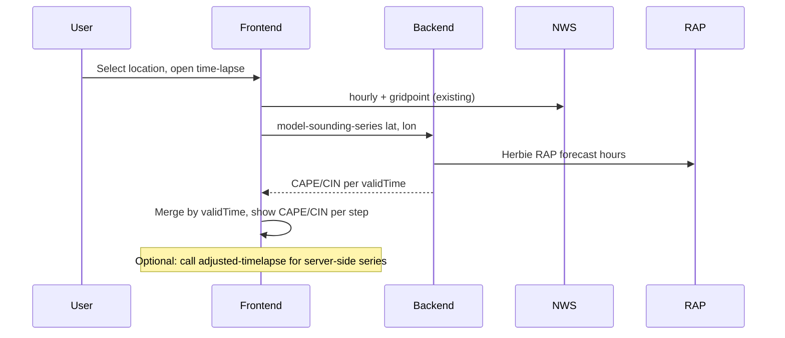

# Sounding + Time-lapse + Region Heat Map Roadmap

## Current state (confirmed)

- **Sounding:** Single source — Wyoming observed (2× daily) or demo. Backend: [backend/app/physics/sounding.py](backend/app/physics/sounding.py) calls `get_real_sounding(lat, lon)`; frontend [frontend/src/components/Sounding.tsx](frontend/src/components/Sounding.tsx) calls `fetchSounding(lat, lon)` with no source parameter.
- **Raw vs Adjusted time-lapse:** All logic is **frontend-only**. [frontend/src/lib/timelapseAdjustment.ts](frontend/src/lib/timelapseAdjustment.ts) builds raw steps from NWS hourly + gridpoint, then computes decaying bias, persistence blend, and uncertainty bands in the browser. [frontend/src/components/DualForecastTimelapse.tsx](frontend/src/components/DualForecastTimelapse.tsx) consumes that and displays two panels with one slider. No CAPE/CIN or model sounding data in the time-lapse.
- **Map / region:** Single point only. [frontend/src/App.tsx](frontend/src/App.tsx) holds `pointData` (one grid cell: gridId, gridX, gridY, lat, lon, URLs). No bounding box or grid layer.

---

## Part 1: Model soundings (RAP/HRRR/NAM) as alternate source + tab

**Goal:** User can switch between “Observed (Wyoming)” and “Model (RAP)” (and optionally HRRR/NAM) in the Sounding block; model soundings update more frequently (hourly with RAP/HRRR).

**Backend**

- **New dependency:** Use a Python library to fetch RAP/HRRR (and optionally NAM) at a point and extract a vertical profile. **Herbie** (`herbie-data`) is a good fit: it downloads NOAA GRIB2 from AWS/NOMADS and returns xarray; supports RAP, HRRR, NAM by run time and product (e.g. pressure levels). No NWS API for soundings; model data is the way to get “more frequent” profiles.
- **New module:** e.g. `backend/app/physics/model_sounding.py` (or under `uwyo_sounding.py` as a sibling). Given `(lat, lon, source="rap"|"hrrr"|"nam", valid_time=None)`:
  - Use Herbie to open the latest (or valid_time) run and the appropriate product (e.g. RAP pressure-level or native).
  - Extract T, Td (and optionally wind) on pressure levels at the nearest grid point to (lat, lon).
  - Compute CAPE/CIN with MetPy from that profile (same pattern as Wyoming/demo).
  - Return the **same shape** as current sounding: `{ source, cape_j_kg, cin_j_kg, profile: [{ p_hpa, T_C, Td_C }], from_time?, station_id? }` so the frontend can reuse the same UI.
- **API:** Extend `GET /physics/sounding` to accept a query param e.g. `source=wyoming|rap|hrrr|nam`. When `source=rap` (or hrrr/nam) and lat/lon are present, call the new model-sounding fetcher; otherwise keep existing Wyoming/demo behavior. Single endpoint, same response contract.

**Frontend**

- **Sounding component:** Add a simple **tab** or **dropdown** above the chart: “Observed (Wyoming)” | “Model (RAP)” | “Model (HRRR)” (and “Model (NAM)” if implemented). Pass `source` into `fetchSounding(lat, lon, { source })`. Continue to show the same chart and CAPE/CIN; only the label and the `source` in the description change (e.g. “RAP (model)” vs “Wyoming (observed)”).
- **API client:** [frontend/src/api/physics.ts](frontend/src/api/physics.ts) — extend `fetchSounding` to accept an optional `source` and append it to the query string.

**Risks / notes**

- Herbie requires GRIB2 index files or full downloads; RAP/HRRR runs have a few hours delay on public NOAA sources. Document “model” as analysis/forecast, not live obs.
- Rate/volume: one request per user switch of tab; no extra load beyond current sounding call.

---

## Part 2: RAP data in Raw vs Adjusted time-lapse (sophisticated, predictive)

**Goal:** (a) Add a **new variable** from model soundings to the time-lapse (e.g. CAPE/CIN per step) for predictive context. (b) Make the adjustment pipeline **more sophisticated and backend-driven** so model sounding data can influence the forecast (e.g. stability-aware adjustment or uncertainty).

**Backend**

- **New endpoint: model-sounding time series.**  
  `GET /physics/model-sounding-series?lat=&lon=&hours=48` (or `valid_times` aligned with NWS hourly).  
  Returns a list of `{ validTime, cape_j_kg, cin_j_kg }` for each forecast hour at (lat, lon). Implementation: use RAP (or HRRR) **forecast** run; for each forecast hour (f00, f01, … up to f18 or available), get the profile at (lat, lon), compute CAPE/CIN with MetPy, then map validTime = run_time + forecast_offset. For hours beyond RAP’s range (e.g. 18h), either use NAM or repeat last RAP value; align valid times with the same hour grid used by the frontend (e.g. hourly). Response shape: `{ series: [{ validTime, cape_j_kg, cin_j_kg }] }`.
- **Adjusted time-lapse endpoint (chosen approach).**  
  `GET /physics/adjusted-timelapse?lat=&lon=&station_id=` (or pass observation as query/body).  
  Returns the **48-step series** (temp, wind speed, wind dir, pop, cape_j_kg, cin_j_kg) with **server-side** logic: raw from NWS gridpoint/hourly, bias from observation at t=0, **decaying bias** applied on the server, and optionally **stability-aware** scaling (e.g. widen uncertainty when CAPE &gt; threshold). This is the **single source of truth** for the time-lapse: better performance and allows future frontend or other consumers to reuse one endpoint. Response shape: list of steps with tempF, windSpeedMph, windDirDeg, pop, cape_j_kg?, cin_j_kg? (and low/high for uncertainty when requested). Logic moves from [frontend/src/lib/timelapseAdjustment.ts](frontend/src/lib/timelapseAdjustment.ts) into the backend.

**Frontend**

- **Dual time-lapse data:** When a location is selected, call the **adjusted-timelapse** endpoint (and optionally keep one NWS hourly request for the raw panel if not included in that response). If the backend returns both raw and adjusted series, frontend only displays them; if it returns only adjusted, frontend still calls NWS for raw or backend exposes raw in the same endpoint.
- **Display:** In both panels show **CAPE** and **CIN** for the current step (e.g. “CAPE: 120 J/kg  CIN: -20 J/kg”). Frontend consumes the backend response and no longer builds steps in [frontend/src/lib/timelapseAdjustment.ts](frontend/src/lib/timelapseAdjustment.ts) for the adjusted/alternate panel.

**Data flow (conceptual)**

---

## Part 3: Geographic region heat-map time-lapse (future)

**Goal:** An **alternate view on the map**: a time-lapse of temperature (and optionally wind, precipitation) over a **geographic region** as a heat map (or colored grid), driven by the same or a synced time slider, using **real data**.

**Data**

- **NWS:** api.weather.gov only exposes **one gridpoint per request** ([backend/app/nws/client.py](backend/app/nws/client.py) — single gridId, gridX, gridY). To cover a region you must request many gridpoints (one per 2.5 km cell). That implies either many sequential/parallel NWS calls or a backend that aggregates them.
- **Model (RAP/HRRR):** One RAP/HRRR run contains **full 2D fields** (e.g. 2 m temp, 10 m wind, precip). Herbie (or direct GRIB2) can subset by **bounding box** and return a 2D grid (lats × lons × values) per valid time. So for a region, **model data is the practical source** for a single-request, grid-aligned heat map.

**Backend**

- **New endpoint:** e.g. `GET /physics/region-timelapse?min_lat=&max_lat=&min_lon=&max_lon=&variable=temp&steps=12` (or 24/48).  
  **First release: temperature only** — get that perfected before adding wind or precipitation. Backend uses RAP (or HRRR) for the latest run; for each requested forecast hour, extracts the 2D field for the bbox (2 m temp in °C), subsamples to a reasonable grid (e.g. 0.05° or ~5 km) to limit payload. Returns e.g. `{ series: [{ validTime, lats[], lons[], values[][] }] }` or GeoJSON. Wind and precip can be added in a later iteration.

**Frontend**

- **Region selection:** Use **current map bounds**. When the user toggles “Region time-lapse” on, send the map’s current bounds (min_lat, max_lat, min_lon, max_lon from the map viewport) to the region-timelapse endpoint. No drawn box in the first version.
- **Layer:** Add a **heat map** (or grid overlay) layer on the map (e.g. Leaflet heat or canvas colored by value). The layer shows the temperature grid for the **current** valid time; when the user scrubs the time-lapse, the layer updates to the corresponding `validTime` in the region series.
- **Sync:** Reuse the same global time index as the single-point time-lapse so region and point stay in sync where possible.

**Dependencies**

- Part 3 builds on Part 2’s backend use of RAP/Herbie: same stack, new endpoint that returns 2D grids instead of point soundings.
- Frontend needs a clear “mode”: single-point dashboard vs region heat map; when region is on, the map is the main view with the time-lapse driving the overlay.

---

## Server-side caching strategy

**Goal:** Avoid flooding NWS, Wyoming, and NOAA (RAP/HRRR) when users move around the map or refresh. Repeated requests for the same or nearby data should be served from cache where safe.

**Current state**

- NWS already uses an in-memory TTL cache: [backend/app/nws/cache.py](backend/app/nws/cache.py) and [backend/app/config.py](backend/app/config.py) (`cache_ttl_seconds = 300`). Keys are request URLs; [backend/app/nws/client.py](backend/app/nws/client.py) checks the cache before `_get()` and stores the response after a successful fetch.

**Extend caching to all server-fetched data**

1. **NWS (keep as-is)**  
   - Keys: full request URL (points, forecast, hourly, gridpoint, observations, alerts).  
   - TTL: keep 5 minutes (configurable).  
   - No change needed except to ensure any new NWS calls (e.g. from adjusted-timelapse) go through the same client and thus the same cache.

2. **Wyoming soundings**  
   - Cache key: e.g. `wyoming_sounding:{station_id}:{from_time}` (00Z/12Z).  
   - TTL: 6–12 hours (observed soundings only update 2× daily).  
   - Implement in the Wyoming fetcher or a thin wrapper: check cache before `fetch_wyoming_sounding`, set after parse.

3. **Model soundings (RAP/HRRR/NAM) — single point**  
   - Used by: `GET /physics/sounding?source=rap&lat=&lon=` and by model-sounding-series.  
   - Cache key: `model_sounding:{source}:{lat:.2f}:{lon:.2f}:{run_time}` (round lat/lon to reduce key explosion; run_time = model run, e.g. “20250210_18z”).  
   - TTL: 1–2 hours (new RAP/HRRR runs every 1–3 h; reusing same run is fine for a while).  
   - Store the full response (profile + CAPE/CIN) or the raw profile so that both the single-sounding endpoint and the “series” builder can share cache entries when the series is built from multiple forecast hours of the same run.

4. **Model-sounding series**  
   - Cache key: `model_sounding_series:{source}:{lat:.2f}:{lon:.2f}:{run_time}` (one key per run; series is all forecast hours for that run).  
   - TTL: same as model sounding (1–2 h).  
   - Reduces repeated Herbie fetches when the user moves slightly (same run, same grid point).

5. **Adjusted-timelapse endpoint**  
   - Cache key: `adjusted_timelapse:{lat:.2f}:{lon:.2f}:{station_id or 'none'}:{tau}` (round lat/lon; include station for bias, tau if in query).  
   - TTL: 5–15 minutes (NWS raw data and observation can change; keep aligned with NWS cache).  
   - Backend assembles from cached NWS (points → gridpoint, hourly, observation) + cached model-sounding-series when possible; only recompute bias and decay.

6. **Region-timelapse**  
   - Cache key: `region_timelapse:{bbox_slug}:{variable}:{run_time}` e.g. bbox_slug = `min_lat_max_lat_min_lon_max_lon` rounded to 2 decimals.  
   - TTL: 1–2 hours (same as model data).  
   - Avoids re-downloading the same RAP/HRRR grid for the same view when the user pans back.

**Implementation**

- Introduce a small **cache module** (e.g. `backend/app/cache.py` or extend existing) used by physics routes: one TTLCache (or namespaced caches) for “external data” with configurable TTLs per key prefix.  
- All new endpoints (sounding with source, model-sounding-series, adjusted-timelapse, region-timelapse) and the Wyoming path should **check cache by key** before calling external services and **set cache** after a successful fetch.  
- Optional: cap cache size (e.g. LRU) so that moving around the country doesn’t grow memory unbounded; prefer short TTLs and key rounding (lat/lon to 2 decimals, bbox to 2 decimals) to reduce key count.

---

## Implementation order and scope

| Part   | Scope                                                        | Depends on                                                                                                                                                  |
| ------ | ------------------------------------------------------------ | ----------------------------------------------------------------------------------------------------------------------------------------------------------- |
| **1**  | Sounding tab (Wyoming vs RAP/HRRR/NAM)                       | Backend model_sounding module + Herbie; extend GET /physics/sounding; frontend tab + fetchSounding(lat, lon, source). Cache Wyoming and model soundings.  |
| **2a** | Model-sounding series endpoint + CAPE/CIN in time-lapse      | Backend model-sounding-series (cached); frontend displays CAPE/CIN per step.                                                                               |
| **2b** | Backend adjusted-timelapse endpoint                          | Backend returns 48-step raw + adjusted series (NWS + observation + RAP series, server-side decay); frontend consumes it; cache by lat/lon/station/tau.   |
| **3**  | Region heat-map time-lapse (temperature, map bounds)        | Backend region-timelapse (RAP 2D temp only, cached); frontend uses current map bounds, heat layer, shared time slider.                                     |
| **Cache** | Server-side caching for all external data                 | Extend/add cache module; TTLs and keys for NWS (existing), Wyoming, model soundings, model-sounding-series, adjusted-timelapse, region-timelapse.          |

**Suggested sequence:** Implement **Part 1** (sounding tab + model sounding + cache for Wyoming and model). Then **Part 2a** (model-sounding-series + cache). Then **Part 2b** (adjusted-timelapse endpoint, frontend switches to it, cache). Then **Part 3** (region-timelapse temp-only, map bounds, cache). Caching is applied incrementally with each feature.

---

## Decisions (locked in)

- **Part 2b:** Backend is the single source of truth for the adjusted time-lapse (performance and future frontend/API consumers).
- **Part 3:** Temperature only for the first release; perfect that before adding wind or precipitation.
- **Region selection:** Use current map bounds when "Region time-lapse" is toggled on (no drawn box).
- **Caching:** All server-fetched data (NWS, Wyoming, RAP/HRRR, and derived endpoints) must use the caching strategy above so moving around the map does not flood upstream services.
